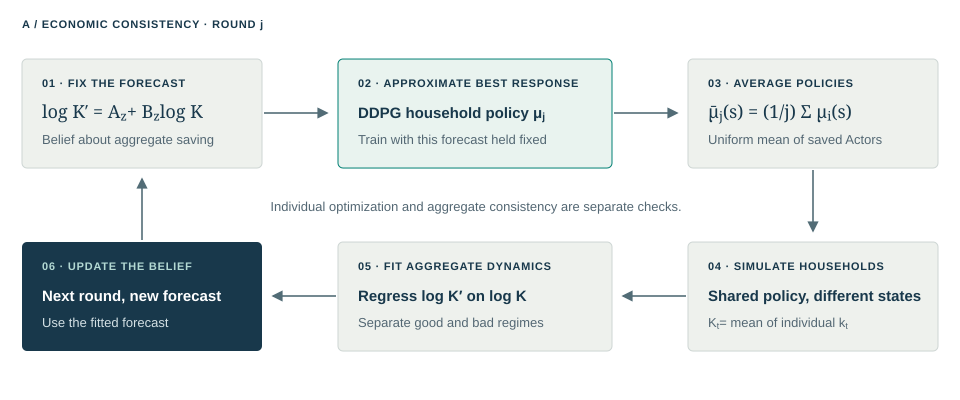
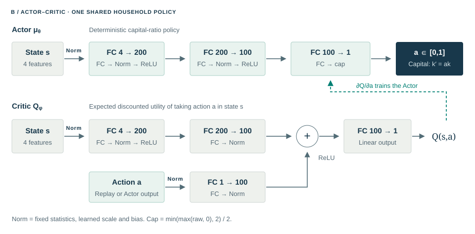
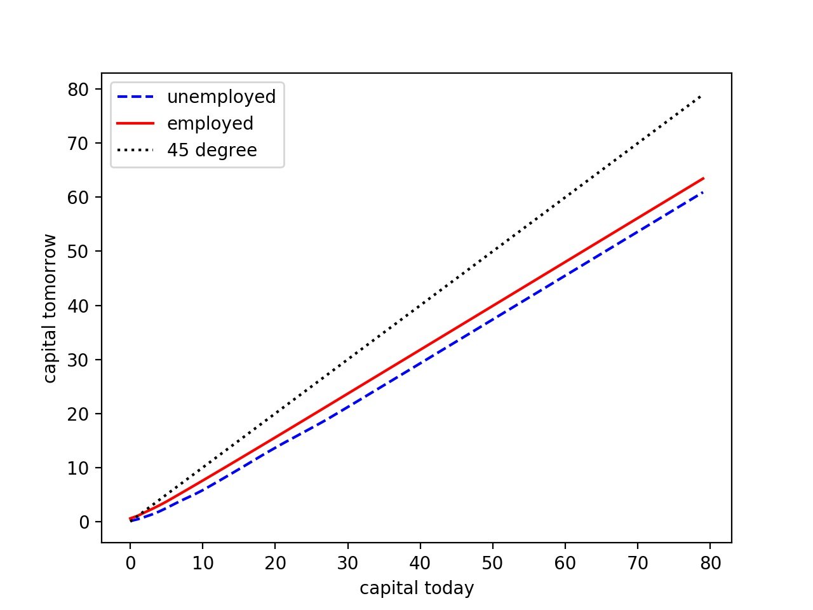
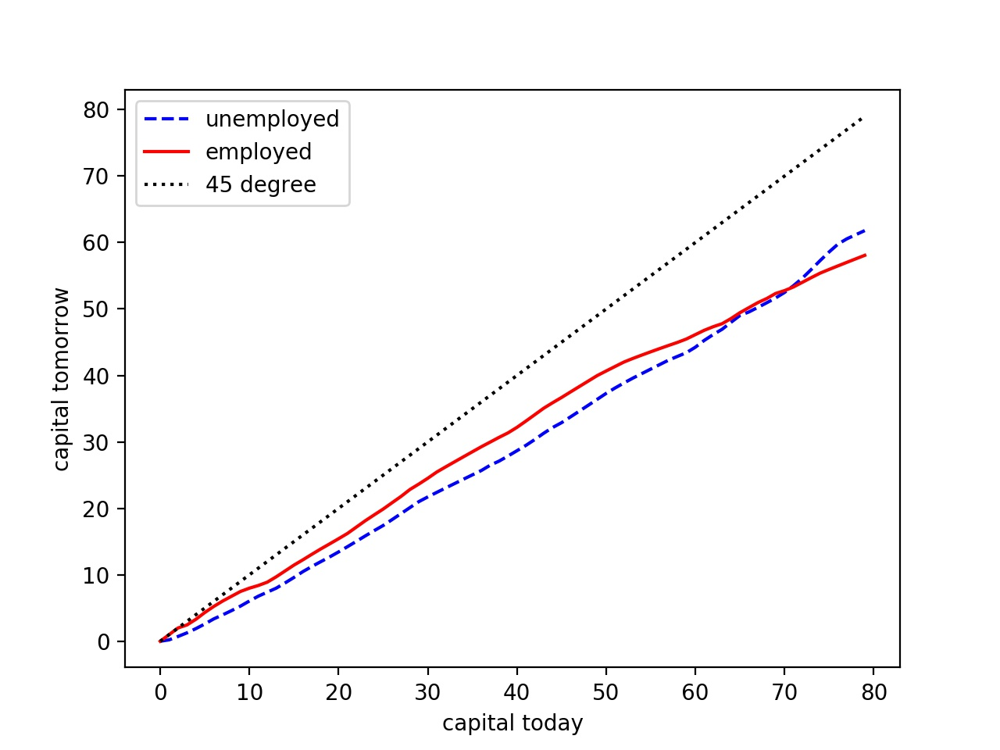
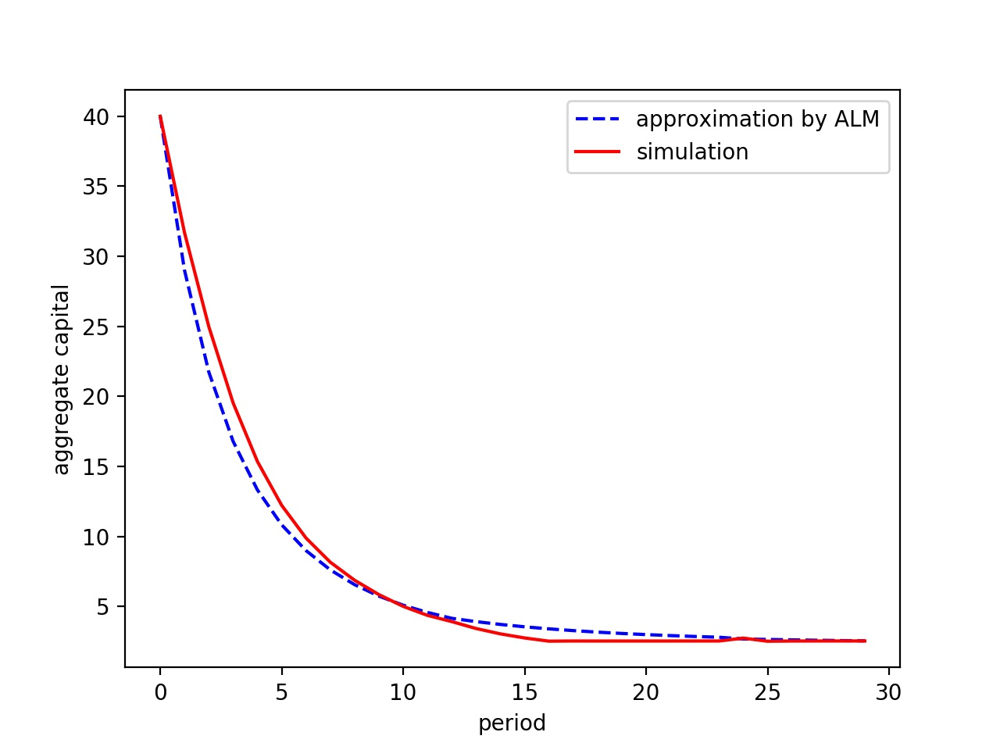
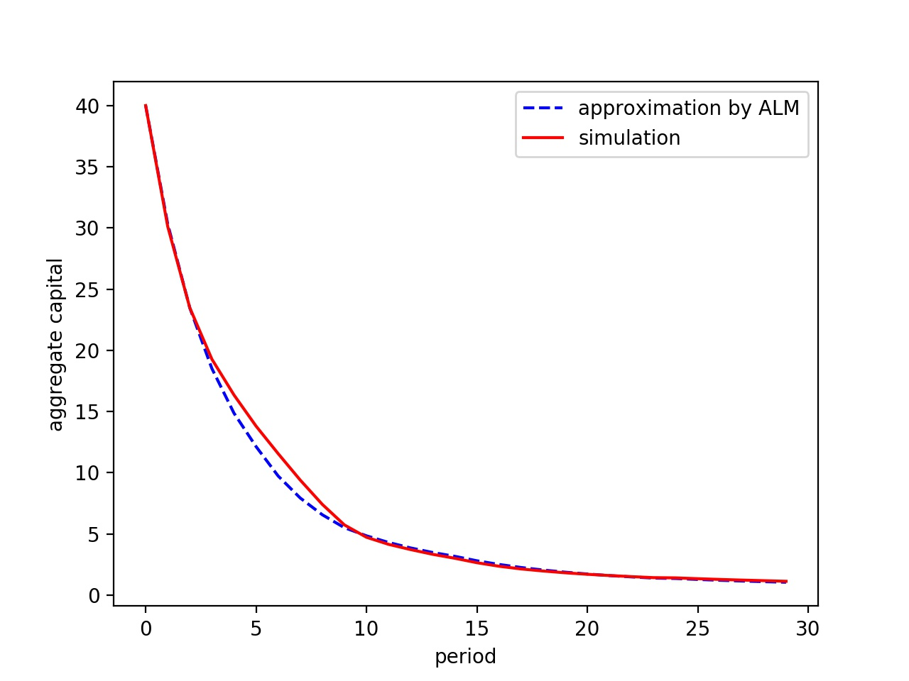
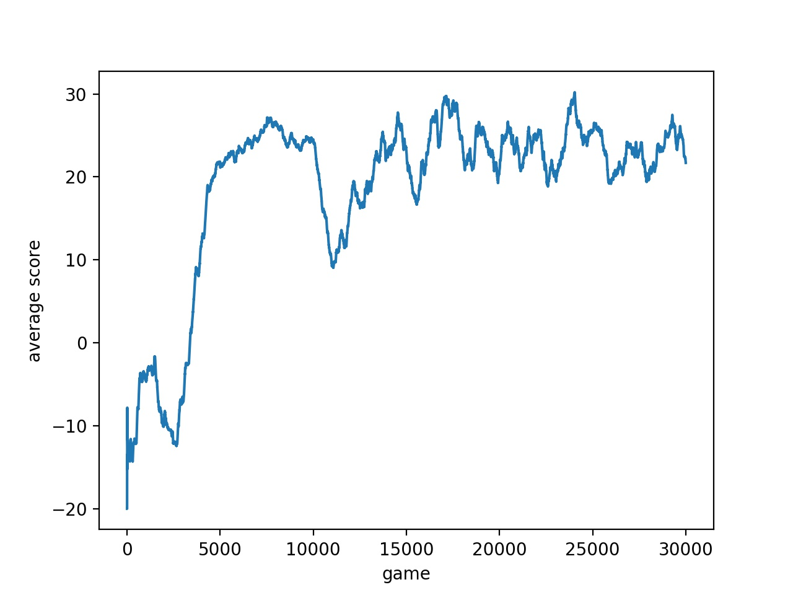

# Krusell–Smith DDPG: reinforcement learning for economics

This project applies deep reinforcement learning to compute an approximate equilibrium of the **Krusell and Smith (1998) model**. The model studies how household saving under uninsured employment risk and common productivity shocks shapes the wealth distribution and aggregate economic dynamics.

The method combines **Deep Deterministic Policy Gradient (DDPG)** with a **fictitious-play-inspired outer fixed-point loop**. DDPG learns a household saving policy for given aggregate dynamics; population simulation then updates those dynamics toward consistency with household behavior.

**Historical baseline result:** DDPG yielded results close to the dynamic-programming benchmark in this project’s baseline experiment ($\beta=0.8$). After five outer rounds, mean discounted utility is **8.8478**, compared with **8.9583** for dynamic programming—a relative utility-score gap of about **1.23%**.

## Project structure

```text
krusell-smith-ddpg/
├── README.md                       # Economic model, RL method, results, and setup
├── docs/figures/                    # Method diagrams and historical result figures
├── reproduction/                   # Modern PyTorch reproduction
│   ├── src/ks_reproduction/         # Economy, DDPG, DP, simulation, evaluation, CLI
│   ├── configs/                    # Smoke, baseline, and robustness profiles
│   ├── data/benchmark/             # DP reference arrays and checksums
│   ├── targets/                    # Numerical targets and provenance
│   ├── docs/                       # Numerical compatibility notes
│   ├── pyproject.toml              # Package dependencies and CLI entry point
│   └── uv.lock                     # Reproducible dependency resolution
└── reproduction-tensorflow/        # Updated, organized TensorFlow 1.14 edition
    ├── src/thesis_tf/              # Stage CLI, verifier, and TensorFlow numerical code
    ├── configs/                    # Round-5, round-20, and smoke configurations
    ├── data/                       # DP inputs, historical checkpoints, and samples
    ├── targets/                    # Published values and historical provenance
    ├── docs/                       # Numerical compatibility notes
    ├── environment.yml             # Python 3.7 environment definition
    └── requirements/               # TensorFlow-era dependency pins
```

Both implementations include their required numerical inputs. New outputs go to ignored `reproduction/outputs/` or `reproduction-tensorflow/runs/` directories. The TensorFlow edition adds explicit stage commands, configurations, verification, and separation of saved inputs from fresh runs while retaining the historical numerical kernels. The PyTorch edition implements training, checkpointing, simulation, and evaluation in a modern framework.

## Getting started

Clone the repository:

```bash
git clone https://github.com/SuperWGAaron/krusell-smith-ddpg.git
cd krusell-smith-ddpg
```

### PyTorch: recommended for new experiments

Use Python 3.11 or newer in a separate environment. From the repository root:

```bash
cd reproduction
python3 -m venv .venv
source .venv/bin/activate
python -m pip install --upgrade pip
python -m pip install -e .
ks-reproduce doctor --config configs/thesis.toml
ks-reproduce reproduce --config configs/smoke.toml
```

Alternatively, use `uv sync --frozen --python 3.13` in `reproduction/` to install the locked environment, then prefix commands with `uv run --frozen`.

The smoke profile checks the complete training, evaluation, plotting, and structural verification pipeline with small dimensions. For full baseline experiments, use `configs/thesis.toml`; this is a substantial training run. See the [PyTorch guide](reproduction/README.md) for individual stages, resuming, devices, and robustness experiments.

### TensorFlow: updated historical implementation

Use an x86-64 Linux or Intel macOS environment with Python 3.7 and TensorFlow 1.14. Keep it separate from the PyTorch environment. From the repository root:

```bash
cd reproduction-tensorflow
conda env create -f environment.yml
conda activate ks-thesis-tf114
python -m pip install -r requirements/legacy-py37.txt
PYTHONPATH=src python -m thesis_tf.cli verify --config configs/thesis.json
```

See the [TensorFlow guide](reproduction-tensorflow/README.md) for training, replaying saved checkpoints, and evaluating fresh runs. The archive verifier can also run with modern Python and NumPy without importing TensorFlow.

The results below come from the historical experiment underlying the author's 2020 work, *A Reinforcement Learning Approach to Krusell and Smith (1998) from the Perspective of Mean Field Game*. Saved TensorFlow checkpoints and evaluation samples support archival checks; a successful smoke run does not establish a fresh reproduction of these numbers. The [numerical targets and compatibility notes](reproduction-tensorflow/docs/LEGACY_COMPATIBILITY.md) record known differences between published and archived values.

## 1. Problem definition: Krusell and Smith (1998) model

[Krusell and Smith (1998)](https://doi.org/10.1086/250034) study how differences in household income and wealth interact with aggregate economic fluctuations. This project uses their baseline stochastic growth economy: a continuum of infinitely lived households with identical preferences but different wealth and employment states. Markets are incomplete: productive capital is the only asset, households cannot borrow, and they cannot directly insure against employment shocks. Saving therefore trades current consumption against future consumption and provides a buffer against unemployment.

| Economic object | RL interpretation |
| --- | --- |
| Individual capital $k$ | Household wealth; a continuous private state |
| Employment $e\in\{0,1\}$ | Individual stochastic state |
| Aggregate capital $K$ | Mean population wealth; affects prices |
| Regime $z\in\{b,g\}$ | A common bad/good shock affecting every household |
| Consumption $c$ | Produces immediate reward $\log c$ |
| Next-period capital $k'$ | Saving decision; becomes the next private state |

### Household control problem

Write $Z_z$ for productivity in regime $z$, and $\ell$ for the fixed labor supplied by an employed household. Using the project’s log utility, available resources and the objective are

$$
m_t=(1+r_t-\delta)k_t+w_t\ell e_t,\qquad
c_t=m_t-k_{t+1},\qquad k_{t+1}\geq0,\quad c_t>0,
$$

$$
\max_\pi\;\mathbb E^\pi\!\left[\sum_{t=0}^{\infty}\beta^t\log c_t\right].
$$

Here $r_t$ is the rental return on capital before depreciation, $w_t$ is the wage per unit of labor, and $\delta$ is depreciation. A larger **discount factor** $\beta$ gives future consumption more weight.

A single good can be consumed or invested in capital. Cobb–Douglas production and competitive factor prices connect household decisions to the population:

$$
Y=Z_zK^\alpha L_z^{1-\alpha},\qquad
r=\alpha Z_z(L_z/K)^{1-\alpha},\qquad
w=(1-\alpha)Z_z(K/L_z)^\alpha,
$$

$$
K_t=\int k\,d\Gamma_t(k,e),\qquad L_z=\ell(1-u_z).
$$

Population mass is normalized to one, so $K_t$ is both total and mean capital. The distribution $\Gamma_t$ records household wealth and employment conditional on the common shock history; $u_z$ is the unemployment rate in regime $z$. The joint Markov transition $P(z',e'\mid z,e)$ couples individual employment risk to aggregate productivity. In the continuum economy, the employment marginal determines aggregate labor through $L_z=\ell(1-u_z)$.

### Equilibrium and the mean-field approximation

A **recursive competitive equilibrium** combines optimal household saving, competitive wages and capital returns, and population dynamics consistent with those saving decisions. This project approaches the equilibrium as a **mean-field game (MFG)**: each household takes prices and aggregate dynamics as given, while collective saving determines future prices.

The exact household state is $(k,e,\Gamma,z)$. Current prices depend on aggregate capital and the productivity regime, but predicting future prices generally requires the distribution because saving depends on household wealth and employment. Following Krusell–Smith’s computational strategy, both methods in this project approximate that distribution by mean capital $K$ and fit a regime-dependent **aggregate law of motion (ALM)**,

$$
\log K_{t+1}=A_{z_t}+B_{z_t}\log K_t,\qquad
H_z(K)=\exp(A_z+B_z\log K).
$$

The resulting household state is $s=(k,K,z,e)$. This is an approximate state compression: different wealth–employment distributions with the same mean need not have identical future dynamics.

| Baseline calibration | Value |
| --- | --- |
| Discount factor / utility | $\beta=0.8$ / $\log c$ |
| Capital share / depreciation | $\alpha=0.36$ / $\delta=0.025$ |
| Productivity, bad / good | $Z_b=0.99$ / $Z_g=1.01$ |
| Unemployment, bad / good | $u_b=0.10$ / $u_g=0.04$ |
| Probability of remaining in either regime | $0.875$ |
| Employed labor $\ell$ | $1/(1-u_b)$, normalizing bad-regime aggregate labor to one |

The Krusell–Smith benchmark uses quarterly periods and $\beta=0.99$; this project’s baseline experiment uses $\beta=0.8$.

## 2. Benchmark: dynamic programming plus aggregate simulation

For a fixed forecast $H$, value-function iteration (VFI) solves

$$
V_H(k,K,z,e)=\max_{0\leq k'<m}
\left\{\log(m-k')+\beta\sum_{z',e'}P(z',e'\mid z,e)
V_H(k',H_z(K),z',e')\right\}.
$$

The maximizing action gives the household saving policy. The benchmark discretizes individual capital into 100 points and aggregate capital into 20 points, with four shock combinations; it interpolates continuation values between grid points.

Starting from $H_z(K)=K$, the solver alternates between VFI, population simulation, and regression of next-period log capital on current log capital. Simulated aggregate capital is the **population mean**, $K_t=N^{-1}\sum_i k_{i,t}$. Updating the ALM closes the equilibrium loop. This is a numerical benchmark, not a closed-form solution.

DDPG replaces the household VFI step with a neural actor–critic. Both approaches retain the same kind of aggregate approximation.

## 3. Proposed method: DDPG inside an aggregate fixed-point loop



*One policy is shared across heterogeneous households. During household training the forecast is fixed; during population simulation aggregate capital is computed from household wealth.*

### Environment and action

The actor receives $(k,K,z,e)$, with $z$ encoded as a binary regime flag, and outputs a capital-retention ratio:

$$
a=\mu_\theta(s)\in[0,1],\qquad k'=ak,\qquad R=\log(m-ak).
$$

The action expresses saving as a fraction of **current capital**, imposing $k'\leq k$. This restricts the policy class: the economic budget also permits accumulation and saving from labor income at $k=0$.

Training resets sample $k,K$ uniformly from $[10^{-3},80]$. The simulator applies $K'=H_z(K)$ and samples the next joint shock. Ornstein–Uhlenbeck (OU) noise perturbs the actor output without clipping. Choices $k'\leq0$ or $k'\geq m$ receive reward $-20$ and terminate; positive but near-zero capital or consumption also terminates. Episodes are capped at 30 steps, with zero continuation value at termination. These penalties and cutoffs approximate the infinite-horizon control problem.

### Networks and updates



The actor uses widths **4 → 200 → 100 → 1**, ReLU hidden activations, and output $\mu_\theta(s)=\operatorname{clip}(h_\theta(s),0,2)/2$. The critic has a **4 → 200 → 100** state branch and **1 → 100** action branch; their outputs are added, passed through ReLU, and mapped to scalar $Q_\phi(s,a)$. Normalization layers learn affine parameters while keeping their running statistics fixed.

For replay samples $(s_i,a_i,R_i,s'_i,d_i)$, where $d_i=1$ denotes termination, the critic target and loss are

$$
\begin{aligned}
y_i&=R_i+\beta(1-d_i)Q_{\bar\phi}(s'_i,\mu_{\bar\theta}(s'_i)),\\
L_Q&=\frac1M\sum_{i=1}^M\left(Q_\phi(s_i,a_i)-y_i\right)^2.
\end{aligned}
$$

The target is detached from differentiation. The actor minimizes

$$
L_\mu=-\frac1M\sum_{i=1}^M Q_\phi(s_i,\mu_\theta(s_i)),
$$

using the critic’s action derivative and holding critic parameters fixed. Target parameters track online parameters through

$$
\bar\theta\leftarrow(1-\tau)\bar\theta+\tau\theta,\qquad
\bar\phi\leftarrow(1-\tau)\bar\phi+\tau\phi.
$$

These are the [DDPG updates](https://arxiv.org/abs/1509.02971). Replay supplies off-policy minibatches; one critic, actor, and target update occurs per environment step once a full batch is available. “Model-free” describes the learner’s updates: the simulator still encodes the economic model.

### Outer algorithm

```text
Initialize H_z(K) = K and the online and target networks.
For each outer round j:
    Hold H fixed; clear replay while retaining learned network parameters.
    Train a household DDPG policy against H; save actor snapshot μ_j.
    Form the pointwise average μ̄_j(s) = (μ_1(s) + … + μ_j(s)) / j.
    Simulate populations with μ̄_j and compute K_t = mean_i(k_i,t).
    Regress log K_(t+1) on log K_t separately for each current regime.
    Replace H with the fitted forecast.
```

This is **fictitious-play-inspired**: it averages deterministic action outputs, not network weights or distribution flows. The flow generated by an averaged policy need not equal the average of the individual flows, so [approximate fictitious-play theory](https://arxiv.org/abs/1907.02633) does not automatically establish convergence here.

| Training parameter | Baseline |
| --- | --- |
| Actor / critic optimizer | Adam / Adam |
| Actor / critic learning rate | $10^{-5}$ / $5\times10^{-5}$ |
| Target update $\tau$ | $0.01$ |
| Replay capacity / minibatch | $10^6$ / $1{,}024$ |
| OU mean / reversion / scale / time step | $0$ / $0.2$ / $0.05$ / $0.01$ |
| Episode cap | 30 steps |
| Episodes | 10,000 in round 1; 5,000 per later round |
| ALM estimation per round | 100 populations × 10,000 households |
| Evaluation rounds | Rounds 5 and 20: 30,000 and 105,000 episodes |

## 4. Results and discussion

The baseline experiment uses $\beta=0.8$. The main comparison evaluates DDPG after **five outer rounds** (30,000 training episodes).

### Discounted sum of utility

Evaluation compares discounted consumption utility over a 30-period window, using **500 aggregate-shock paths × 5,000 households**, with $k_0=K_0=40$. Higher utility is better.

| Method | Mean utility ↑ | Standard deviation | Minimum | Maximum |
| --- | ---: | ---: | ---: | ---: |
| DP / VFI | 8.9583 | 0.1789 | 6.0919 | 9.0802 |
| DDPG, round 5 | 8.8478 | 0.2016 | 2.3053 | 8.9971 |

DDPG’s mean is **0.1105 utility units below DP**, a relative utility-score gap of **1.23%**. Average performance is close, although DDPG has greater dispersion and a substantially lower minimum. The percentage compares log-utility scores; it is not a consumption-equivalent welfare loss.

### Policy function

| DP saving policy | DDPG saving policy, round 5 |
| --- | --- |
|  |  |

*Saving decisions at $K=40$ in the good regime, for employed and unemployed households. The diagonal marks $k'=k$.*

Both methods produce a broadly similar, nearly linear relationship between current and next-period capital, with decumulation over most of the plotted range. DDPG has visible kinks and reverses the ordering of employed and unemployed policies at high wealth. After twenty outer rounds, this ordering reversal disappears, although kinks remain. Replay becoming concentrated at low wealth is a plausible explanation for weaker high-wealth accuracy; the experiment does not isolate this mechanism.

### Aggregate law of motion

Each method fits $\log K_{t+1}=A_z+B_z\log K_t$ to its simulated population. Rounded coefficient estimates and regression fit are:

| Method and regime | Intercept $A_z$ | Slope $B_z$ | $R^2$ |
| --- | ---: | ---: | ---: |
| DP, good | 0.080 | 0.893 | 0.997929 |
| DP, bad | 0.075 | 0.893 | 0.997512 |
| DDPG, good | −0.001 | 0.925 | 0.999041 |
| DDPG, bad | −0.038 | 0.927 | 0.998255 |

| DP aggregate capital | DDPG aggregate capital, round 5 |
| --- | --- |
|  |  |

*Population mean capital and the path implied by the fitted ALM under the same aggregate-shock sequence within each panel.*

Both fits have $R^2>0.997$ and capture the broad decline in aggregate capital. This supports the ALM approximation on each method’s simulated data; it does not by itself establish household optimality or equilibrium convergence.

### DDPG training score



The curve averages training-episode scores over a trailing window of **1,000 episodes**; the first 1,000 points average all episodes available so far. Scores improve sharply early in training, dip around episode 11,000, and fluctuate roughly between 20 and 30 after episode 15,000. This suggests improvement followed by a variable plateau, rather than monotonic convergence.

Training uses random initial states, exploration noise, feasibility penalties, and early termination. These episode reward scores track learning behavior and are distinct from the fixed-initial-state discounted-utility comparison above.

### Discussion

**Model-free learning and model knowledge.** DDPG learns from transitions generated by a specified economic simulator. Using known rewards and dynamics more directly could improve data efficiency, but a computational advantage requires measurement. Model-based deep RL has demonstrated strong results across diverse tasks—for example, [DreamerV3 (Hafner et al., 2025)](https://www.nature.com/articles/s41586-025-08744-2) learns through imagined trajectories. Such methods are possible extensions to this project.

**Long horizons and discounting.** Experiments with higher discount factors or longer episodes were unsuccessful. Longer rollouts increase computation, but high discount factors do not inherently require long training episodes: bootstrapping can estimate continuation beyond sampled fragments. For this infinite-horizon problem, an artificial time limit should permit bootstrapping; a genuinely finite-horizon formulation should include remaining time in the state. This distinction is formalized by [Pardo et al. (2018)](https://proceedings.mlr.press/v80/pardo18a.html) and reflected in [Gymnasium’s termination/truncation API](https://farama.org/Gymnasium-Terminated-Truncated-Step-API). VFI also becomes harder as $\beta$ approaches one because its discounted Bellman contraction weakens.

**Network and environment design.** Performance is sensitive to exploration and episode length. Progress in normalization and training design has made some deep RL methods more robust across tasks, as illustrated by DreamerV3, but does not remove problem-specific choices. Here, the action restriction $k'\leq k$, feasibility penalties, and replay coverage directly affect the learned solution. Broader feasible actions and controlled ablations are useful extensions. Comparisons across independent training seeds with uncertainty estimates would also strengthen the evidence, following [Agarwal et al. (2021)](https://arxiv.org/abs/2108.13264).

**Adaptation to other mean-field problems.** The reusable idea is the combination of individual policy learning and population updates. Applying it elsewhere requires suitable rewards, constraints, aggregate states, and equilibrium checks. Related research develops neural policy mixing and online mirror descent for MFGs ([Laurière et al., 2022](https://proceedings.mlr.press/v162/lauriere22a.html)), including population-aware policies for varying initial distributions and common noise ([Wu et al., 2025](https://arxiv.org/abs/2509.03030)). These methods suggest extensions to this project, while transfer and convergence of the continuous-saving DDPG scheme remain open questions.
